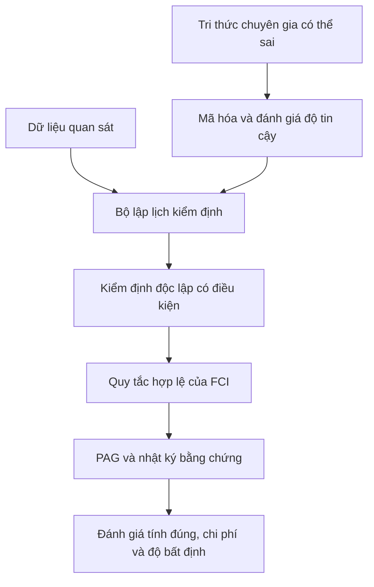

# Đề cương high-level: Tận dụng tri thức chuyên gia không hoàn hảo trong khám phá nhân quả có nhiễu ẩn

**Tên ngắn của hướng nghiên cứu:** Safe Imperfect Priors for Latent-Confounded Causal Discovery  
**Mức tài liệu:** High-level — dùng để hiểu bài toán và trình bày với mentor  
**Thời điểm rà soát tài liệu:** Tháng 9 năm 2026

## 1. Tóm tắt trong một phút

Khám phá nhân quả cố gắng suy ra cấu trúc nguyên nhân–kết quả từ dữ liệu. Khi tồn tại biến gây nhiễu không được quan sát, ta thường không thể khôi phục duy nhất một đồ thị nhân quả có hướng. Đầu ra hợp lý hơn là một **đồ thị tổ tiên riêng phần** (Partial Ancestral Graph, viết tắt PAG), biểu diễn tất cả các cấu trúc còn tương thích với dữ liệu và giả định.

Trong thực tế, ta thường có thêm tri thức từ chuyên gia hoặc mô hình ngôn ngữ lớn: biến nào xảy ra trước, quan hệ nào có vẻ hợp lý, nhóm biến nào có thể cùng chịu một nguyên nhân ẩn. Tri thức này có thể giúp thuật toán tìm kiếm nhanh hơn hoặc chính xác hơn khi dữ liệu ít. Tuy nhiên, nó cũng có thể sai, thiên lệch và sai theo từng cụm có hệ thống.

Bài toán nghiên cứu là:

> Làm thế nào sử dụng tri thức chuyên gia không hoàn hảo để hỗ trợ thuật toán khám phá nhân quả có biến gây nhiễu ẩn, nhưng không biến lời đoán của chuyên gia thành bằng chứng nhân quả và không làm mất tính hợp lệ của PAG?

Ý tưởng trung tâm là: **tri thức bên ngoài chỉ hướng dẫn thứ tự tìm kiếm và phân bổ ngân sách kiểm định; dữ liệu và các quy tắc nhân quả hợp lệ mới quyết định cạnh nào được giữ hoặc định hướng.**

## 2. Một ví dụ trực giác

Giả sử ta nghiên cứu quan hệ giữa:

- chất lượng giấc ngủ;
- mức căng thẳng;
- lượng cà phê;
- năng suất học tập;
- mức độ khó của môn học.

Ta không quan sát được hoàn toàn “áp lực cá nhân”, một biến có thể làm tăng cả lượng cà phê lẫn căng thẳng. Vì vậy, tương quan giữa cà phê và căng thẳng không nhất thiết là quan hệ nhân quả trực tiếp.

Một chuyên gia hoặc mô hình ngôn ngữ có thể cung cấp nhận định:

- độ khó môn học có trước năng suất học tập;
- giấc ngủ ảnh hưởng đến năng suất;
- cà phê có thể ảnh hưởng đến giấc ngủ;
- căng thẳng và lượng cà phê có thể có nguyên nhân chung.

Một số nhận định đúng, một số sai, và độ tin cậy của chúng không giống nhau. Nếu ép thuật toán phải tuân theo toàn bộ nhận định, một lỗi có thể lan truyền thành nhiều cạnh sai. Nhưng nếu bỏ qua tri thức này hoàn toàn, thuật toán phải thực hiện rất nhiều kiểm định độc lập có điều kiện và có thể hoạt động kém khi số mẫu nhỏ.

Hướng nghiên cứu đề xuất một cách sử dụng trung gian:

- không ép cạnh theo lời chuyên gia;
- ưu tiên kiểm tra các quan hệ mà chuyên gia cho là quan trọng;
- ưu tiên các tập điều kiện có khả năng phân tách hai biến;
- giữ lại nhật ký cho biết kết luận nào đến từ dữ liệu, kết luận nào chỉ là gợi ý;
- khi hết ngân sách, trả về một PAG thận trọng thay vì đoán thêm hướng cạnh.

## 3. Tại sao bài toán này có ý nghĩa?

### 3.1. Dữ liệu quan sát thường không đầy đủ

Trong y tế, kinh tế, giáo dục và hành vi người dùng, nhiều nguyên nhân quan trọng không được đo hoặc không thể đo. Giả định “không có biến gây nhiễu ẩn” thường không thực tế.

### 3.2. Thuật toán FCI có thể tốn nhiều kiểm định

FCI và các biến thể được thiết kế cho trường hợp có nhiễu ẩn, nhưng phải tìm kiếm nhiều tập điều kiện và đường đi có thể. Khi số biến tăng hoặc dữ liệu ít, các kiểm định trở nên đắt và thiếu ổn định.

### 3.3. Tri thức bên ngoài có ích nhưng không đáng tin tuyệt đối

Tri thức chuyên gia có thể giúp thu hẹp tìm kiếm. Mô hình ngôn ngữ có thể cung cấp tri thức ngữ nghĩa từ tên và mô tả biến. Tuy nhiên:

- mô hình ngôn ngữ học từ tương quan trong văn bản;
- lời khuyên thay đổi theo cách hỏi;
- lỗi thường có tương quan, không độc lập giữa các cạnh;
- độ tự tin bằng lời không nhất thiết được hiệu chỉnh tốt;
- benchmark có thể vô tình tiết lộ cấu trúc đúng trong prompt.

### 3.4. Khoảng trống còn lại có phạm vi đủ cụ thể

[Guess2Graph](https://arxiv.org/abs/2510.14488) đã chỉ ra rằng lời đoán của chuyên gia có thể dùng để sắp thứ tự kiểm định trong thuật toán PC mà vẫn giữ tính nhất quán. Tuy nhiên, PC thường giả định không có nhiễu ẩn. [Learning to Defer](https://arxiv.org/abs/2502.13132) học khi nào nên tin chuyên gia, nhưng trọng tâm là bài toán nhân quả từng cặp biến. [tFCI](https://arxiv.org/abs/2503.21526) sử dụng tri thức phân tầng trong bối cảnh có biến ẩn, nhưng tri thức được giả định đúng. Vì vậy, giao điểm sau vẫn đáng nghiên cứu:

> PAG/FCI + nhiễu ẩn + tri thức có thể sai và sai có hệ thống + cơ chế an toàn không biến tri thức thành bằng chứng.

## 4. Những khái niệm cần hiểu

| Khái niệm | Giải thích ngắn |
|---|---|
| DAG | Đồ thị có hướng không chu trình, biểu diễn quan hệ nhân quả trong trường hợp lý tưởng. |
| Biến gây nhiễu ẩn | Biến không quan sát được nhưng ảnh hưởng đến từ hai biến quan sát trở lên. |
| MAG | Đồ thị tổ tiên cực đại, biểu diễn quan hệ giữa các biến quan sát sau khi đã ẩn đi một số biến. |
| PAG | Đại diện cho một lớp các MAG không thể phân biệt bằng các quan hệ độc lập có điều kiện quan sát được. |
| FCI | Thuật toán dựa trên kiểm định độc lập có điều kiện để tìm PAG trong sự hiện diện của biến ẩn. |
| Tri thức tiên nghiệm | Thông tin bên ngoài dữ liệu, chẳng hạn thứ tự thời gian, nhóm biến hoặc lời khuyên của chuyên gia. |
| No-harm | Mục tiêu rằng lời khuyên sai không làm hỏng tính đúng đắn cơ bản của thuật toán. |
| Chế độ đầy đủ | Cuối cùng vẫn thực hiện mọi kiểm định cần thiết; tri thức chỉ đổi thứ tự. |
| Chế độ giới hạn ngân sách | Chỉ thực hiện được một phần kiểm định; cần trả về kết luận thận trọng. |

## 5. Phát biểu bài toán nghiên cứu

Ta quan sát dữ liệu (D) trên các biến (X_1,\ldots,X_p). Hệ thống thật có thể chứa biến ẩn. Thuật toán cơ sở trả về một PAG (P).

Ta đồng thời nhận được một tập lời khuyên (K), chẳng hạn:

- (X_i) có trước (X_j);
- (X_i) và (X_j) có khả năng liên hệ;
- một đường đi qua nhóm biến nào đó đáng được kiểm tra trước;
- hai biến có thể cùng chịu một nguyên nhân ẩn;
- một số biến không thể là nguyên nhân của biến khác.

Lời khuyên (K) có thể sai, không được hiệu chỉnh và có lỗi tương quan.

Mục tiêu không phải là khôi phục bằng mọi giá một DAG duy nhất. Mục tiêu là:

1. giữ đầu ra ở dạng PAG hợp lệ;
2. giảm số kiểm định hoặc tăng chất lượng hữu hạn mẫu;
3. không để lời khuyên trực tiếp quyết định cạnh;
4. thể hiện rõ độ bất định cấu trúc;
5. suy giảm an toàn khi chất lượng lời khuyên giảm.

## 6. Câu hỏi nghiên cứu

### RQ1 — Tính an toàn

> Nếu lời khuyên hoàn toàn sai, thuật toán có còn hội tụ về cùng PAG như FCI khi dữ liệu tăng và mọi kiểm định cần thiết đều được thực hiện không?

### RQ2 — Lợi ích hữu hạn mẫu

> Khi lời khuyên tốt hơn ngẫu nhiên ở cấp đường đi hoặc tập phân tách, nó có giúp giảm số kiểm định hoặc giảm lỗi định hướng trong dữ liệu nhỏ không?

### RQ3 — Lỗi tương quan

> Phương pháp hoạt động thế nào khi chuyên gia sai theo cả một nhóm quan hệ, thay vì sai độc lập từng cạnh?

### RQ4 — Giới hạn ngân sách

> Khi không đủ ngân sách chạy hết FCI, có thể trả về một PAG thận trọng kèm chứng nhận về những gì đã và chưa được kiểm tra không?

### RQ5 — Vai trò phù hợp của mô hình ngôn ngữ

> Loại lời khuyên nào từ mô hình ngôn ngữ có ích nhất: thứ tự thời gian, nhóm biến, đường đi ưu tiên hay hướng cạnh?

## 7. Các giả thuyết có thể kiểm tra

- **H1:** Trong chế độ đầy đủ, thay đổi thứ tự kiểm định nhưng không lược bỏ kiểm định sẽ giữ nguyên kết quả tiệm cận của thuật toán cơ sở.
- **H2:** Khi lời khuyên có tín hiệu ở cấp đường đi/tập phân tách, thuật toán ưu tiên sẽ cần ít kiểm định hơn để đạt cùng chất lượng PAG.
- **H3:** Ép cạnh theo tri thức cứng sẽ suy giảm mạnh dưới lỗi tương quan; phương pháp chỉ hướng dẫn tìm kiếm sẽ suy giảm từ từ hơn.
- **H4:** Lời khuyên mức cao như thứ tự thời gian hoặc nhóm biến an toàn và ổn định hơn lời khuyên hướng từng cạnh.
- **H5:** Trong chế độ giới hạn ngân sách, đầu ra thận trọng có ít định hướng sai hơn một thuật toán cố hoàn thành PAG bằng phỏng đoán.

## 8. Hình dung hệ thống đề xuất

Nguyên tắc quan trọng là mũi tên từ tri thức chuyên gia không đi thẳng đến PAG. Nó chỉ đi qua bộ lập lịch kiểm định.

## 9. Cách thực hiện ở mức cao

### Giai đoạn 1 — Xây nền và tái lập

- Tái lập FCI/RFCI trên dữ liệu sinh từ MAG.
- Tái lập một cơ chế tri thức cứng để thấy lỗi lan truyền.
- Tái lập ý tưởng sắp thứ tự của Guess2Graph trong trường hợp không có biến ẩn.

### Giai đoạn 2 — Xây mô hình lời khuyên

Tạo ba nguồn lời khuyên:

1. **Nguồn có kiểm soát:** biết chính xác xác suất sai.
2. **Nguồn lỗi tương quan:** sai theo nhóm biến hoặc mô-típ.
3. **Nguồn mô hình ngôn ngữ:** hỏi từ mô tả biến, nhưng không cung cấp đồ thị đúng.

### Giai đoạn 3 — Xây thuật toán

- Mã hóa lời khuyên thành mức ưu tiên.
- Ưu tiên cặp biến, tập điều kiện và đường đi cần kiểm tra.
- Chỉ dùng kết quả kiểm định và quy tắc FCI để thay đổi PAG.
- Ghi lại nguồn gốc mỗi kết luận.

### Giai đoạn 4 — Đánh giá

Thay đổi có hệ thống:

- số biến quan sát;
- mật độ biến ẩn;
- số mẫu;
- dạng quan hệ tuyến tính hoặc phi tuyến;
- chất lượng và kiểu lỗi lời khuyên;
- ngân sách số kiểm định.

## 10. Thí nghiệm tối thiểu để quyết định có nên theo hướng này

Thí nghiệm 3–4 tuần đầu:

1. Sinh MAG với 10–20 biến quan sát và một số biến ẩn.
2. Chạy FCI với cùng tập kiểm định nhưng ba thứ tự khác nhau:
   - ngẫu nhiên;
   - oracle;
   - lời khuyên bị nhiễu có tương quan.
3. Giới hạn ngân sách kiểm định ở nhiều mức.
4. Đo chất lượng PAG, số định hướng sai và số kiểm định.

**Bằng chứng tiếp tục:** thứ tự tốt tạo đường cong chất lượng–chi phí tốt hơn rõ ràng, và lời khuyên bị nhiễu không phá hỏng kết quả nhanh như tri thức cứng.

**Bằng chứng dừng:** thứ tự gần như không ảnh hưởng khi kiểm định được hiệu chỉnh công bằng; hoặc phần mở rộng từ Guess2Graph sang FCI chỉ là thay đổi mã nguồn nhỏ, không phát sinh câu hỏi mới.

## 11. Dữ liệu và thước đo

### Dữ liệu

- MAG sinh tổng hợp với ground truth.
- Mô hình tuyến tính Gaussian, phi tuyến cộng nhiễu và dữ liệu rời rạc/hỗn hợp.
- Một vài mạng nhân quả chuẩn để minh họa.
- Mô tả biến bằng ngôn ngữ tự nhiên để lấy lời khuyên từ mô hình ngôn ngữ.

### Thước đo chính

- độ chính xác cạnh kề của PAG;
- độ chính xác dấu ở đầu cạnh;
- lỗi quan hệ tổ tiên;
- tỷ lệ định hướng không hợp lệ;
- số kiểm định độc lập có điều kiện;
- thời gian chạy;
- đường cong chất lượng theo ngân sách;
- mức suy giảm khi chất lượng lời khuyên giảm.

## 12. Đầu ra kỳ vọng

Một project hoàn chỉnh nên tạo ra:

1. **Một phát biểu an toàn rõ ràng:** điều kiện nào bảo đảm lời khuyên chỉ đổi thứ tự mà không đổi kết quả tiệm cận.
2. **Một thuật toán:** phiên bản FCI/RFCI được tăng cường bằng lời khuyên không hoàn hảo.
3. **Một bộ sinh lời khuyên lỗi:** độc lập, tương quan, có hệ thống và đối nghịch.
4. **Một bộ đánh giá:** chất lượng PAG, chi phí kiểm định và độ bền trước lời khuyên sai.
5. **Một kết quả khoa học:** xác định loại lời khuyên nào thực sự hữu ích và khi nào không nên dùng.
6. **Một gói tái lập:** mã nguồn, cấu hình, seed, dữ liệu sinh và kết quả máy đọc được.

## 13. Kế hoạch 6–7 tháng

| Thời gian | Công việc | Mốc đầu ra |
|---|---|---|
| Tháng 1 | Đọc FCI/PAG; tái lập baseline; xây MAG generator | Baseline đáng tin cậy |
| Tháng 2 | Xây bộ sinh lời khuyên và thí nghiệm kill test | Báo cáo quyết định tiếp tục/dừng |
| Tháng 3 | Thiết kế bộ lập lịch và nhật ký bằng chứng | Thuật toán nguyên mẫu |
| Tháng 4 | Phân tích tính an toàn; mở rộng lỗi tương quan | Mệnh đề/định lý sơ bộ |
| Tháng 5 | Chạy ma trận thí nghiệm và ablation | Bảng kết quả chính |
| Tháng 6 | Kiểm tra mô hình ngôn ngữ và dữ liệu minh họa | External check |
| Tháng 7 | Viết paper, hoàn thiện mã và artifact | Bản nộp hoàn chỉnh |

## 14. Những gì project không nên tuyên bố

- Không tuyên bố mô hình ngôn ngữ “biết” quan hệ nhân quả.
- Không tuyên bố khôi phục DAG thật khi dữ liệu chỉ xác định được PAG.
- Không coi độ tự tin bằng lời của mô hình ngôn ngữ là xác suất đúng.
- Không gọi kết quả là no-harm trong chế độ giới hạn ngân sách nếu chưa có bảo đảm.
- Không chỉ báo cáo Structural Hamming Distance mà bỏ qua dấu đầu cạnh và quan hệ tổ tiên.

## 15. Câu hỏi nên trao đổi với mentor

1. Nên tập trung vào FCI đầy đủ hay RFCI để kiểm soát độ phức tạp?
2. Đóng góp chính nên là bảo đảm an toàn, giảm chi phí kiểm định hay độ bền hữu hạn mẫu?
3. Có cần dùng mô hình ngôn ngữ ngay từ đầu, hay chỉ thêm sau khi cơ chế đã được kiểm tra bằng lỗi có kiểm soát?
4. Đầu ra trong chế độ giới hạn ngân sách nên là PAG thận trọng, tập PAG hay phân bố trên PAG?
5. Cần chứng minh mức nào để paper không bị xem là phần mở rộng cơ học của Guess2Graph?
6. Nên chọn một lĩnh vực ứng dụng nào có tri thức phân tầng đáng tin hơn hướng cạnh, chẳng hạn y tế hoặc chuỗi thời gian?

## 16. Tài liệu đọc đầu tiên

1. [From Guess2Graph: When and How Can Unreliable Experts Safely Boost Causal Discovery in Finite Samples?](https://arxiv.org/abs/2510.14488)
2. [Learning to Defer for Causal Discovery with Imperfect Experts](https://arxiv.org/abs/2502.13132)
3. [Causal Discovery with Language Models as Imperfect Experts](https://arxiv.org/abs/2307.02390)
4. [LLM Cannot Discover Causality, and Should Be Restricted to Non-Decisional Support](https://arxiv.org/abs/2506.00844)
5. [Constraint-based Causal Discovery with Tiered Background Knowledge and Latent Variables](https://arxiv.org/abs/2503.21526)
6. [dcFCI: Robust Causal Discovery Under Latent Confounding, Unfaithfulness, and Mixed Data](https://arxiv.org/abs/2505.06542)

## 17. Kết luận để trình bày với mentor

Đề tài không hỏi liệu mô hình ngôn ngữ có thể tự tìm đồ thị nhân quả hay không. Nó hỏi một câu hẹp và kiểm chứng được hơn:

> Khi dữ liệu ít và có biến gây nhiễu ẩn, liệu lời khuyên không hoàn hảo có thể giúp FCI tìm kiếm hiệu quả hơn mà vẫn giữ ranh giới giữa “gợi ý” và “bằng chứng” hay không?

Nếu thành công, đóng góp chính không phải là một đồ thị có điểm số cao hơn, mà là một nguyên tắc tích hợp tri thức ngoài dữ liệu theo cách có thể kiểm tra, suy giảm an toàn và tôn trọng bất định nhân quả.
