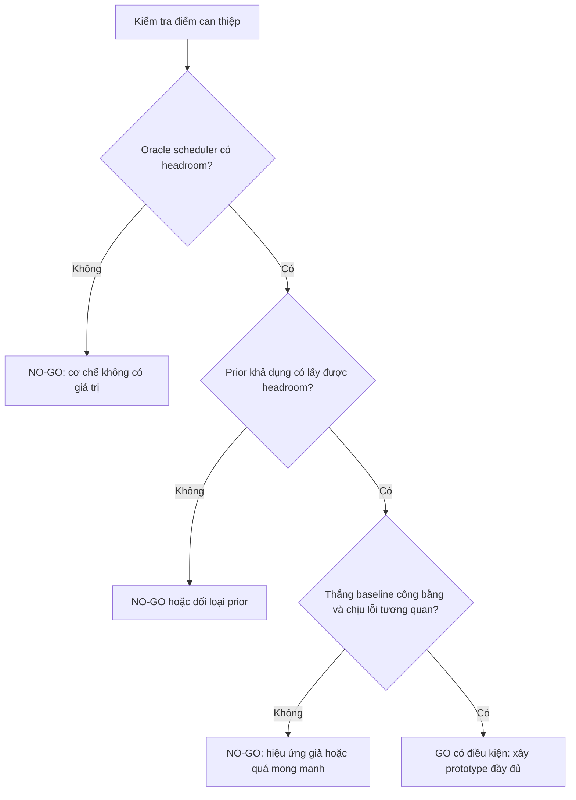

# Kill test cho đề tài “Safe Imperfect Priors”

**Mục tiêu:** Trong 2–3 tuần, quyết định có nên đầu tư 6–12 tháng vào hướng dùng tri thức không hoàn hảo để lập lịch khám phá nhân quả có nhiễu ẩn hay không.

**Phạm vi:** FCI/RFCI, dữ liệu quan sát độc lập cùng phân phối, có biến ẩn, đầu ra PAG. Prior chỉ được dùng để xếp thứ tự kiểm định hoặc phân bổ ngân sách; prior không được trực tiếp xóa, thêm hay định hướng cạnh.

**Ngày chốt thiết kế:** 19/09/2026.

---

## 1. Quyết định cần đưa ra

Kill test không nhằm chứng minh phương pháp hoàn chỉnh. Nó chỉ trả lời bốn câu hỏi theo thứ tự:

1. **Có dư địa để lập lịch tốt hơn không?** Nếu ngay cả lịch dùng ground truth cũng không giảm đáng kể chi phí, đề tài không có cơ chế để khai thác.
2. **Một loại prior có thể thu được trong thực tế có khai thác được dư địa đó không?** Nếu chỉ “oracle” trực tiếp biết kiểm định nào đúng mới giúp, framing hiện tại không khả thi.
3. **Lợi ích có còn sau các đối chứng công bằng không?** Phải so với FCI-stable/RFCI-stable, lịch ngẫu nhiên và lịch chỉ dùng dữ liệu/chi phí.
4. **Prior sai có gây hỏng kết quả theo cách không thể phát hiện không?** Chế độ đủ ngân sách phải đúng như thuật toán gốc dưới oracle CI; chế độ giới hạn ngân sách phải công khai phần chưa kiểm tra và không được quảng cáo là “no-harm”.

---

## 2. Các giả thuyết có thể bị bác bỏ

### H0 — Tính hợp lệ cơ học

Khi dùng oracle CI và chạy đủ ngân sách, mọi lịch hợp lệ phải cho cùng PAG với FCI-stable/RFCI-stable cơ sở.

- Prior chỉ chọn truy vấn tiếp theo trong tập truy vấn đang hợp lệ.
- Scheduler phải tôn trọng phụ thuộc giữa skeleton, Possible-D-SEP và các bước định hướng.
- Mọi dấu cạnh phải truy được về kết quả CI và quy tắc FCI, không truy trực tiếp về prior.

**Bác bỏ H0:** Có bất kỳ graph seed nào cho PAG khác baseline dưới oracle CI mà nguyên nhân không phải tie-breaking đã được chứng minh tương đương.

### H1 — Có dư địa xếp lịch

Một lịch dùng thông tin oracle có thể giảm ít nhất 20% số kiểm định CI để đạt cùng chất lượng skeleton/PAG so với baseline không prior.

**Bác bỏ H1:** Cận trên oracle không đạt ngưỡng trên, hoặc chỉ đạt trong một cấu hình hiếm.

### H2 — Prior có thể sử dụng được

Prior không biết trực tiếp kết quả CI, nhưng có lợi thế xếp hạng vừa phải, có thể thu hồi ít nhất 30% phần tiết kiệm mà oracle scheduler đạt được.

**Bác bỏ H2:** Prior chỉ giúp khi gần hoàn hảo, hoặc direct query oracle giúp nhưng prior dạng tri thức cấu trúc không giúp.

### H3 — Hiệu ứng không phải do baseline yếu

Lợi ích vẫn tồn tại khi so với:

- FCI-stable/RFCI-stable;
- lịch ngẫu nhiên;
- lịch ưu tiên tập điều kiện nhỏ;
- lịch chỉ dùng trạng thái đồ thị và chi phí;
- phương pháp targeted testing/score-guided gần nhất nếu có mã tái lập được.

**Bác bỏ H3:** Hiệu ứng biến mất khi đổi từ FCI vanilla sang stable, hoặc khi thêm baseline chỉ dùng dữ liệu.

### H4 — Lỗi tương quan không phá hủy toàn bộ lợi ích

Ở cùng chất lượng xếp hạng biên, prior có lỗi theo nút hoặc theo mô-típ không được làm kết quả giảm mạnh hơn baseline theo cách có hệ thống.

**Bác bỏ H4:** Kết quả chỉ tốt với lỗi độc lập; lỗi tương quan làm mất toàn bộ lợi ích hoặc gây sai endpoint khó phát hiện.

---

## 3. Định nghĩa “an toàn” trong kill test

Không dùng “an toàn” theo nghĩa prior sai không bao giờ làm giảm accuracy. Điều này không hợp lý trong chế độ giới hạn ngân sách vì prior quyết định kiểm định nào được chạy trước.

Trong kill test, “an toàn” chỉ gồm ba cam kết kiểm tra được:

1. **An toàn về nguồn gốc kết luận:** prior không trực tiếp tạo quyết định cấu trúc.
2. **An toàn khi chạy đủ:** dưới oracle CI, chạy đủ cho kết quả giống thuật toán cơ sở.
3. **An toàn về báo cáo:** khi hết ngân sách, hệ thống trả cả graph hiện tại, nhật ký kiểm định, vùng chưa kiểm tra và ngân sách; không trình bày trạng thái tìm kiếm dở dang như một PAG hoàn chỉnh đã được xác nhận.

Nếu muốn bảo đảm “bounded harm” dưới ngân sách, đó là câu hỏi của giai đoạn sau. Không nên dùng nó làm điều kiện đầu vào cho kill test.

---

## 4. Thiết kế tối thiểu theo bốn pha

## Pha 0 — Audit cơ học và novelty

**Thời gian:** 2–3 ngày.

### Việc làm

1. Chọn một implementation FCI/RFCI có chế độ stable hoặc tự bọc để cập nhật adjacency theo batch.
2. Ghi lại các điểm có thể thay đổi lịch:
   - thứ tự cặp biến;
   - thứ tự tập điều kiện trong cùng một cặp;
   - thứ tự xử lý Possible-D-SEP;
   - thứ tự giữa các truy vấn đã đủ tiền đề.
3. Xây `query_log` ghi:
   - cặp `(i,j)`;
   - tập điều kiện `Z`;
   - giai đoạn thuật toán;
   - kết quả CI;
   - chi phí;
   - truy vấn nào được mở sau kết quả này;
   - điểm từ prior, graph và cost.
4. Chạy oracle CI trên 20 MAG nhỏ, mỗi graph chạy với 10 lịch ngẫu nhiên.

### Điều kiện qua

- 100% kết quả cuối trùng baseline stable dưới oracle CI.
- Có ít nhất một điểm lập lịch không tầm thường ngoài việc đổi thứ tự vòng lặp.
- Có thể truy vết mọi thay đổi PAG về CI evidence và quy tắc định hướng.

### Điều kiện dừng

- Không thể đổi lịch mà không thay đổi tập truy vấn hoặc logic kết luận.
- “Mở rộng sang FCI” chỉ là thay tên PC-Guess và không phát sinh vấn đề Possible-D-SEP/PAG mới.
- Sau một tuần vẫn không tạo được oracle-equivalent scheduler.

## Pha 1 — Đo trần lợi ích bằng oracle scheduler

**Thời gian:** 3–4 ngày.

Pha này tách câu hỏi “có tín hiệu prior thực tế hay không” khỏi câu hỏi cơ bản hơn: “không gian tìm kiếm có đủ headroom để xếp lịch hay không”.

### Dữ liệu

Sinh DAG trên biến quan sát và biến ẩn, sau đó lấy latent projection thành MAG và PAG oracle.

| Trục | Giá trị |
|---|---|
| Số biến quan sát | 10, 20 |
| Tỷ lệ biến ẩn | 0.2, 0.4 |
| Bậc trung bình | 2, 4 |
| Graph seed | 20 mỗi ô |
| CI | Oracle |

Tổng cộng: `2 × 2 × 2 × 20 = 160` graph. Đây là quy mô đủ nhỏ để debug nhưng đủ để tránh kết luận từ vài graph thuận lợi.

### Scheduler so sánh

1. `stable_default`: lịch mặc định của FCI-stable/RFCI-stable.
2. `random_valid`: chọn ngẫu nhiên trong các truy vấn đang hợp lệ.
3. `cost_only`: ưu tiên `|Z|` nhỏ; tie-break cố định.
4. `graph_only`: dùng trạng thái đồ thị nhưng không dùng ground truth hay prior.
5. `oracle_query`: biết truy vấn nào tìm được separating set hợp lệ; chỉ dùng để đo cận trên.

### Chỉ số chính

1. Số CI test để đạt 95% chất lượng skeleton cuối của baseline.
2. Chi phí có trọng số:

\[
C_w=\sum_{q=(i,j,Z)} (|Z|+2)^3.
\]

3. Thời gian để tìm separating set đầu tiên cho mỗi cặp không kề nhau.
4. Chất lượng–ngân sách tại 10%, 25%, 50% và 100% ngân sách baseline.

Luôn báo cáo cả số test thô, phân bố kích thước `Z` và thời gian thực; không được kết luận chỉ từ `C_w`.

### Cổng K1

**Qua** nếu oracle scheduler:

- giảm trung vị ít nhất 20% số CI test để đạt cùng chất lượng;
- cận dưới bootstrap 95% của mức giảm lớn hơn 10%;
- đạt điều này trong ít nhất 3/4 nhóm chính theo kích thước graph và tỷ lệ biến ẩn.

**NO-GO ngay** nếu không qua K1. Nếu oracle không tạo headroom, học prior tốt hơn cũng không cứu được đề tài.

## Pha 2 — Prior tổng hợp có lỗi độc lập và tương quan

**Thời gian:** 4–5 ngày.

### Hai loại prior

#### A. Query oracle bị nhiễu — chỉ để chẩn đoán

Điểm trực tiếp cho từng truy vấn, sau đó thêm nhiễu. Nó cho biết scheduler cần lợi thế xếp hạng bao nhiêu, nhưng không đại diện cho expert/LLM thực tế.

#### B. Prior về thành viên tập phân tách — loại khả dụng hơn

Với mỗi bộ ba `(i,j,z)`, prior dự đoán liệu `z` có hữu ích trong một minimal separating set của `(i,j)` hay không. Scheduler chuyển các dự đoán bộ ba thành điểm cho tập `Z` bằng công thức cố định trước khi xem test set.

Prior B không được nhận nhãn “truy vấn này sẽ độc lập”. Nó chỉ cung cấp tín hiệu cấu trúc có thể mô phỏng từ chuyên gia, ontology hoặc mô hình ngôn ngữ.

### Mức chất lượng prior

Hiệu chỉnh theo **AUC xếp hạng truy vấn hữu ích**, không theo edge accuracy:

| Chế độ | AUC mục tiêu |
|---|---:|
| Gần ngẫu nhiên | 0.55 |
| Trung bình | 0.65 |
| Khá | 0.75 |
| Đối nghịch | 0.40–0.45 |

### Kiểu lỗi

1. **Độc lập:** lật từng claim độc lập.
2. **Theo nút:** chọn một nhóm nút “mù”; mọi claim liên quan đến chúng cùng dễ sai.
3. **Theo mô-típ:** nhầm common cause, chain và collider theo từng vùng graph.

Giữ AUC biên xấp xỉ bằng nhau giữa lỗi độc lập và lỗi tương quan. Nếu không làm bước này, ta không biết kết quả xấu đến từ correlation hay đơn giản từ prior kém hơn.

### Cổng K2

Prior B ở AUC 0.65 phải:

- lấy lại ít nhất 30% phần tiết kiệm của oracle scheduler;
- giảm ít nhất 8% trung vị số CI test so với baseline prior-free tốt nhất;
- có cận dưới bootstrap 95% lớn hơn 0;
- qua ít nhất 3/4 nhóm chính.

### Cổng K3 về độ bền

- Với lỗi theo nút hoặc mô-típ ở cùng AUC, lợi ích không được mất quá 50% so với lỗi độc lập.
- Không được thua baseline prior-free quá 5% một cách có hệ thống ở AUC 0.55.
- Ở prior đối nghịch, hệ thống được phép thua, nhưng phải thể hiện degradation rõ trên log/risk curve; không được sinh endpoint “có vẻ chắc chắn” trực tiếp từ prior.

Nếu chỉ query oracle bị nhiễu qua nhưng prior B không qua, kết luận là **scheduling có headroom nhưng giao diện prior hiện tại không khả thi**. Không được tuyên bố GO cho đề tài như hiện tại.

## Pha 3 — Mẫu hữu hạn và tích hợp đầu-cuối

**Thời gian:** 4–6 ngày.

Chỉ chạy pha này nếu K1 qua.

### Ma trận nhỏ

| Trục | Giá trị |
|---|---|
| Số biến quan sát | 20 |
| Tỷ lệ biến ẩn | 0.3 |
| Bậc trung bình | 2.5 |
| Cơ chế | Tuyến tính Gaussian |
| Cỡ mẫu | 500, 2000 |
| Graph seed | 30 |
| Data seed mỗi graph | 3 |

Tổng 180 dataset, chạy paired trên cùng graph/data seed.

### Baseline bắt buộc

- FCI-stable và RFCI-stable không prior;
- random scheduler;
- cost-only và graph-only scheduler;
- oracle scheduler;
- prior B với lỗi độc lập, theo nút và theo mô-típ;
- hard-prior baseline như một đối chứng âm;
- FCIT hoặc phương pháp targeted/score-guided gần nhất nếu mã đủ tái lập. Nếu chưa thể tái lập trong kill test, phải ghi đây là **literature risk chưa đóng**, không được coi là đã thắng.

### Chỉ số PAG

1. Adjacency precision/recall/F1.
2. Precision của endpoint xác định: tail và arrowhead.
3. Số endpoint xác định sai trên mỗi graph.
4. Lỗi quan hệ tổ tiên.
5. Số vòng tròn/chưa quyết định và vùng chưa kiểm tra.
6. AUC của chất lượng–ngân sách.
7. Số CI test, phân bố `|Z|`, `C_w`, wall-clock.

### Nguyên tắc so sánh công bằng

- Cùng CI test, alpha, graph seed, data seed và ngân sách.
- Dùng paired difference theo graph/data seed.
- Không coi cạnh là các mẫu độc lập.
- Đăng ký trước chỉ số chính: **số CI test để đạt 95% adjacency F1 của baseline đủ ngân sách**.
- Chỉ số an toàn chính: **số endpoint xác định sai trên mỗi graph ở cùng ngân sách**.

### Cổng K4

**Qua** nếu prior B AUC 0.65:

- cải thiện chi phí theo ngưỡng K2;
- không tăng trung bình quá 0.1 endpoint xác định sai/graph so với baseline ở cùng ngân sách, hoặc có khoảng tin cậy cho thấy mức tăng không đáng kể theo biên đã đăng ký;
- xu hướng còn ở cả `n=500` và `n=2000`;
- lợi ích không biến mất khi dùng stable baseline và graph-only baseline.

Ngưỡng `0.1 endpoint/graph` là biên dự án, không phải hằng số khoa học. Trước khi chạy phải xác nhận nó có ý nghĩa với quy mô graph; nếu đổi, phải đổi trước khi xem kết quả.

---

## 5. Bảng quyết định cuối

| Kết quả | Quyết định | Diễn giải |
|---|---|---|
| K1 thất bại | **NO-GO** | Không có headroom ngay cả với oracle |
| K1 qua, prior B thất bại | **NO-GO cho framing hiện tại** | Scheduler có ích về lý thuyết nhưng loại tri thức khả dụng không chuyển thành tín hiệu truy vấn |
| Chỉ lỗi độc lập qua | **NO-GO hoặc đổi trọng tâm** | Benchmark quá dễ; không phản ánh expert/LLM sai theo cụm |
| Lợi ích mất trước stable/data-only baseline | **NO-GO** | Hiệu ứng đến từ baseline yếu hoặc order dependence |
| Oracle equivalence thất bại | **NO-GO cho thiết kế scheduler** | Prior đã can thiệp vào logic kết luận hoặc phụ thuộc truy vấn bị xử lý sai |
| K1–K4 qua nhưng chỉ khi AUC ≥ 0.65 | **GO WITH CONDITIONS** | Giới hạn claim vào prior có lợi thế xếp hạng đo được; cần bộ phát hiện prior yếu |
| K1–K4 qua ở nhiều kiểu lỗi | **GO** | Có cơ chế, tín hiệu khả dụng, độ bền và tích hợp đầu-cuối |

---

## 6. Expected output của kill test

### Đầu ra bắt buộc

1. `decision_memo.md`: kết luận GO / GO WITH CONDITIONS / NO-GO, không sửa ngưỡng sau khi xem kết quả.
2. `configs/kill_test/*.yaml`: toàn bộ cấu hình đã đóng băng.
3. `seed_manifest.csv`: graph, data, prior và scheduler seed tách riêng.
4. `query_logs/*.jsonl`: toàn bộ lịch và kết quả CI.
5. `runs.parquet`: một dòng cho mỗi run, đủ để tái tạo biểu đồ.
6. Bộ kiểm thử oracle equivalence.
7. Năm hình chính:
   - oracle headroom;
   - cost–quality curve;
   - mức lợi ích theo prior AUC;
   - khoảng cách giữa lỗi độc lập và lỗi tương quan;
   - failure map theo mật độ graph và tỷ lệ biến ẩn.

### Đầu ra khoa học tối thiểu có giá trị dù NO-GO

- Bản đồ cho biết khi nào test ordering không thể giúp FCI/RFCI.
- Bộ sinh prior lỗi tương quan được hiệu chỉnh theo ranking AUC.
- Evaluator PAG/endpoint có unit test.
- Kết quả âm phân biệt “không có headroom” với “prior không đủ tín hiệu”.

---

## 7. Ước lượng thời gian, công sức và compute

| Hạng mục | Công sức một người | Compute dự kiến |
|---|---:|---:|
| Pha 0: instrument + oracle equivalence | 2–3 ngày | 5–20 CPU giờ |
| Pha 1: oracle headroom | 3–4 ngày | 20–80 CPU giờ |
| Pha 2: prior và lỗi tương quan | 4–5 ngày | 30–120 CPU giờ |
| Pha 3: mẫu hữu hạn | 4–6 ngày | 80–300 CPU giờ |
| Phân tích và decision memo | 2 ngày | nhỏ |
| **Tổng** | **15–20 ngày công** | **135–520 CPU giờ** |

Các con số phụ thuộc mạnh vào implementation FCI và mật độ graph. Có thể chạy trên một máy nhiều lõi; không cần GPU và không cần gọi LLM trong kill test đầu tiên.

---

## 8. Thứ tự triển khai khuyến nghị

### Ngày 1–3

- Chọn implementation stable.
- Viết oracle CI adapter và query logger.
- Kiểm tra invariance trên graph rất nhỏ bằng brute force khi có thể.

### Ngày 4–7

- Chạy Pha 1.
- Vẽ oracle headroom.
- Ra quyết định K1 ngay; nếu fail thì dừng.

### Ngày 8–12

- Xây prior B và ba bộ sinh lỗi.
- Hiệu chỉnh AUC trước khi chạy test set.
- Chạy Pha 2 và quyết định K2/K3.

### Ngày 13–18

- Chạy mẫu hữu hạn.
- Thêm hard-prior negative baseline.
- Nếu có thể, tái lập targeted-testing baseline.

### Ngày 19–20

- Khóa bảng kết quả.
- Viết decision memo.
- Không “cứu” đề tài bằng cách mở rộng hyperparameter sau khi fail cổng chính.

---

## 9. Ba bẫy cần tránh

### Bẫy 1 — Đo prior bằng edge accuracy

Edge accuracy không cho biết prior có xếp đúng các separating-set query hay không. Chỉ số cốt lõi phải là ranking AUC hoặc rank của truy vấn hữu ích.

### Bẫy 2 — So với FCI vanilla

Constraint-based discovery có vấn đề order dependence ở mẫu hữu hạn; các biến thể stable được thiết kế để giảm vấn đề này. Nếu chỉ thắng FCI vanilla, đóng góp có thể chỉ là một cách chọn thứ tự biến thuận lợi.

### Bẫy 3 — Trộn lỗi scheduler với lỗi CI

Nếu bắt đầu ngay bằng finite-sample CI, khi kết quả xấu ta không biết do scheduler, prior hay statistical test. Bắt buộc chạy oracle CI trước.

---

## 10. Tài liệu đe dọa novelty phải kiểm tra song song

- [Guess2Graph](https://arxiv.org/abs/2510.14488): prior chỉ hướng dẫn chuỗi kiểm định trong PC và vẫn giữ consistency; đề tài này phải chứng minh phần FCI/PAG/Possible-D-SEP tạo ra câu hỏi mới.
- [Tiered FCI / tiered IOD](https://arxiv.org/abs/2503.21526): cho thấy background knowledge đúng có thể tăng hiệu quả và informativeness khi có latent variables; kill test phải tập trung vào tri thức sai và lỗi tương quan.
- [Efficient Latent Variable Causal Discovery: Combining Score Search and Targeted Testing](https://arxiv.org/abs/2510.04263): targeted testing đã trực tiếp nhắm vào hiệu quả FCI; đây là baseline/literature threat quan trọng.
- [Order-independent constraint-based causal structure learning](https://arxiv.org/abs/1211.3295): lý do bắt buộc dùng stable baseline.
- [RFCI](https://arxiv.org/abs/1104.5617): baseline nhanh hơn FCI và có thể làm giảm dư địa mà prior scheduler định khai thác.

---

## 11. Kết luận thiết kế

Kill test nên ưu tiên kiểm tra **cơ chế xếp lịch** chứ chưa gọi LLM. LLM tạo thêm chi phí, leakage và biến động nhưng không trả lời được câu hỏi cơ bản nhất: nếu có một prior hữu ích, FCI/RFCI có đủ headroom để biến nó thành lợi ích đo được hay không.

Tiêu chí quan trọng nhất là:

> Nếu oracle scheduler không tiết kiệm đáng kể, dừng. Nếu oracle giúp nhưng prior cấu trúc có lỗi tương quan không thu hồi được phần đáng kể của lợi ích, dừng hoặc đổi giao diện prior. Chỉ tiếp tục khi hiệu ứng còn tồn tại trước stable baseline và baseline chỉ dùng dữ liệu.
